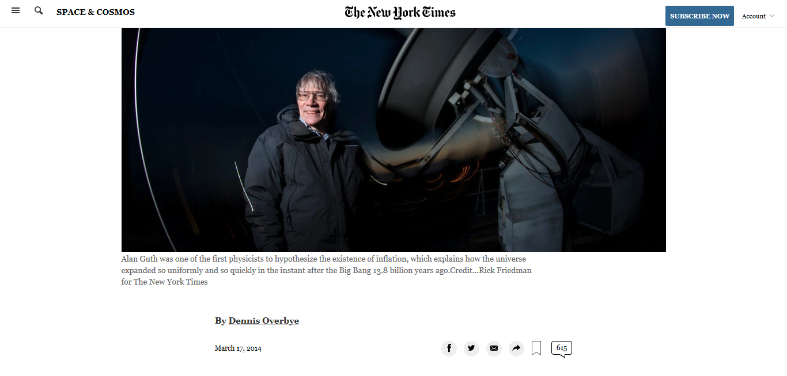

# MC-project3
Building a fixed layout page

## Microverse HTML/CSS project 3
This project consists of replicating the [Space Ripples Reveal Big Bang’s Smoking Gun](https://www.nytimes.com/2014/03/18/science/space/detection-of-waves-in-space-buttresses-landmark-theory-of-big-bang.html?_r=0) article form the [New York Times](https://www.nytimes.com).

#### I. The project was based on a fixed layout:
 - The page was set to be displayed with a static width (1366px-1700px).
 - For mobile and tablet displays the page loads in a full screen size saving its original dimensions at a 1366px width.
 - No media queries were used.

#### II. The layout was built with HTML and CSS,  focusing on a static layout making use of:
 - Grid elements
 - Flexboxes
 - positioning
 - SVG images

#### III. The main areas of the project can be divided as follows:

  ###### &nbsp; The header
  It was created to remain fixed on the top of the page containing the standard icons for navigations purposes.

  ###### &nbsp; The media icons
  It contains the main icons for sharing the article.

  ###### &nbsp; The main content
  It comprises the main layout to display the article content (text, figures, and videos).

  ###### &nbsp; The featured section
  It has the pictures and text featuring related articles.

  ###### &nbsp; The footer
  It contains the links to other sections and articles, media links and the copyright notice.

## Built With

- HTML & CSS
- Code Editors- Atom

## Live Demo

- [Live Demo Link](https://rawcdn.githack.com/Jhdezj/MC-project3/2a6a0ad22f52526d116ca8f65f3e5cb398730156/index.html)
- [full picture](assets/images/NYtimes-readme-full.png)

## Author

👤 **Jorge Hernandez**

- Github: [@Jhdezj](https://github.com/Jhdezj)
